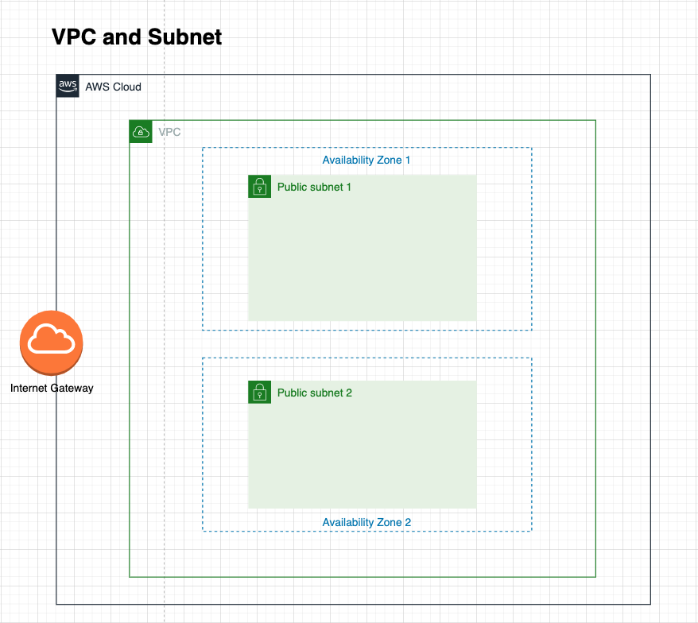

# 4.1 VPC and Subnets

## Introduction

Amazon Virtual Private Cloud (Amazon VPC) enables you to launch AWS resources into a virtual network that you've defined.

A subnet is a range of IP addresses in your VPC. You launch AWS resources, such as Amazon EC2 instances, into your subnets. You can connect a subnet to the internet, other VPCs, and your own data centers, and route traffic to and from your subnets using route tables

---
#### Instructions

Now we will take a look at `vpc-subnets.yml` to understand the creation of our VPC and subnets to hold our application.

```
AWSTemplateFormatVersion: '2010-09-09'
Description: VPC for ecs test

Resources:

  VPC:
    Type: 'AWS::EC2::VPC'
    Properties:
      CidrBlock: '10.0.0.0/16'
      EnableDnsSupport: true
      EnableDnsHostnames: true
      InstanceTenancy: default
  
  # Two public subnets, where containers can have public IP addresses
  PublicSubnet1:
    Type: AWS::EC2::Subnet
    Properties:
      VpcId: !Ref VPC
      AvailabilityZone: !Select [0, !GetAZs '']
      CidrBlock: !Sub '10.0.0.0/24'
      MapPublicIpOnLaunch: true

  PublicSubnet2:
    Type: AWS::EC2::Subnet
    Properties:
      VpcId: !Ref VPC
      AvailabilityZone: !Select [1, !GetAZs '']
      CidrBlock: !Sub '10.0.1.0/24'
      MapPublicIpOnLaunch: true

  # Setup networking resources for the public subnets. Containers
  # in the public subnets have public IP addresses and the routing table
  # sends network traffic via the internet gateway.
  InternetGateway:
    Type: 'AWS::EC2::InternetGateway'

  VPCGatewayAttachment:
    Type: 'AWS::EC2::VPCGatewayAttachment'
    Properties:
      InternetGatewayId: !Ref InternetGateway
      VpcId: !Ref VPC
  
  RouteTable:
    Type: 'AWS::EC2::RouteTable'
    Properties:
      VpcId: !Ref VPC
  
  PublicSubnet1RouteTableAssociation1:
    Type: 'AWS::EC2::SubnetRouteTableAssociation'
    Properties:
      SubnetId: !Ref PublicSubnet1
      RouteTableId: !Ref RouteTable
  
  PublicSubnet2RouteTableAssociation2:
    Type: 'AWS::EC2::SubnetRouteTableAssociation'
    Properties:
      SubnetId: !Ref PublicSubnet2
      RouteTableId: !Ref RouteTable
  
  InternetRoute:
    Type: 'AWS::EC2::Route'
    DependsOn: VPCGatewayAttachment
    Properties:
      GatewayId: !Ref InternetGateway
      RouteTableId: !Ref RouteTable
      DestinationCidrBlock: '0.0.0.0/0'

Outputs:

  VPC:
    Description: VPC
    Value: !Ref VPC
    Export:
      Name: 'VPC'
  
  PublicSubnet1:
    Description: 'Public Subnet 1 on AZ1'
    Value: !Ref PublicSubnet1
    Export:
      Name: 'PublicSubnet1'
  
  PublicSubnet2:
    Description: 'Public Subnet 2 on AZ2'
    Value: !Ref PublicSubnet2
    Export:
      Name: 'PublicSubnet2'
```
---

Proceed to upload this template to Cloudformation to provision our VPC layer and public subnets. The following is a high level diagram to illustrate what you have just built.


